# A2 Report

Author: ??? 

Date: YYYY-MM-DD 

Check [readme.txt](readme.txt) for course work statement and self-evaluation. 
  
## Q1 Graphics pipeline (description)

### Q1.1 Graphics primitives

Graphics primitives are the basic elements used to construct images in computer graphics. Common primitives include points, lines, and polygons (such as triangles and rectangles). These are defined by their vertices and are the building blocks for more complex shapes and scenes.

### Q1.2 Graphics pipeline operations

The graphics pipeline is a sequence of steps that transforms 3D objects into a 2D image. Key operations include vertex processing, primitive assembly, rasterization, fragment processing, and output merging. Each stage applies transformations, shading, and other effects to produce the final rendered image.

### Q1.3 Coordinate systems & transformations

Coordinate systems in graphics include world, object, camera (view), and screen coordinates. Transformations such as translation, rotation, and scaling are used to convert between these systems, allowing objects to be positioned, oriented, and sized appropriately in a scene.

### Q1.4 Scan conversion

Scan conversion is the process of converting geometric data (like lines and polygons) into pixel data for display on a screen. Algorithms such as Bresenham's line algorithm and polygon filling techniques are used to determine which pixels should be illuminated.

### Q1.5 Hand-on Midpoint algorithm

{width=90%}

## Q2 OpenGL and Glut (lab practice)

### Q2.1 OpenGL primitives 

Complete? Yes

<!--If you answer Yes, insert one or more screenshot images to show the completion.-->

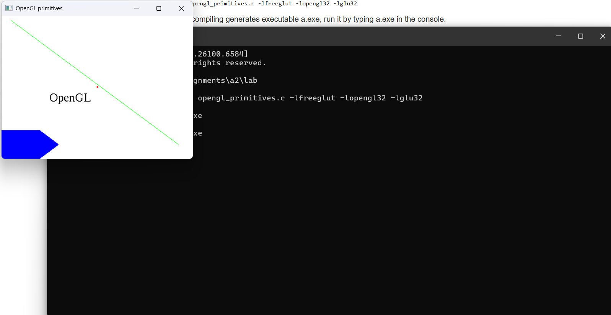{width=90%}
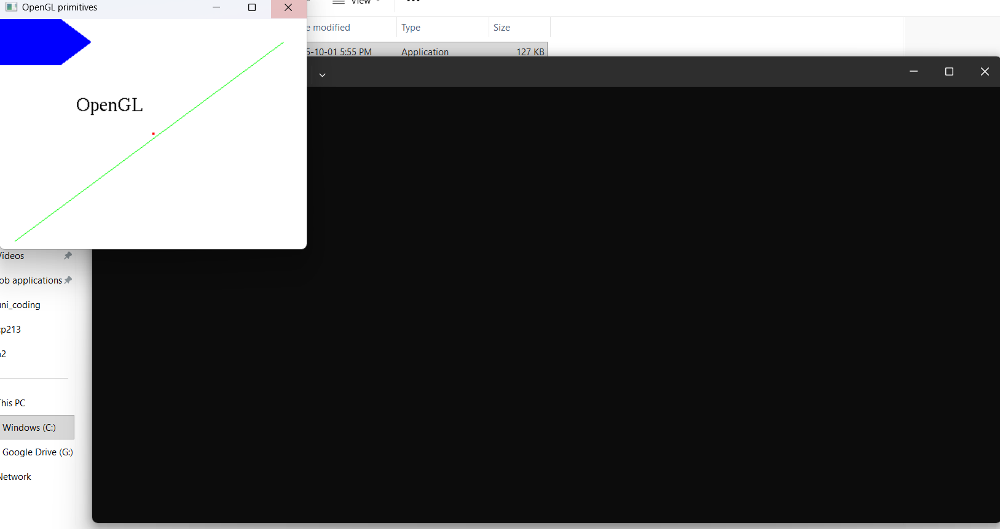{width=90%}

<!-- If No, add a short description to describe the issues encountered.-->

### Q2.2 Interactive graphics 

Complete? Yes

<!--If you answer Yes, insert one or more screenshot images to show the completion.-->

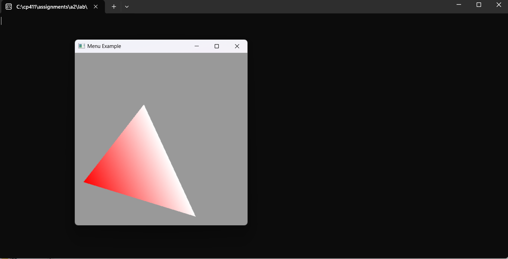{width=90%}
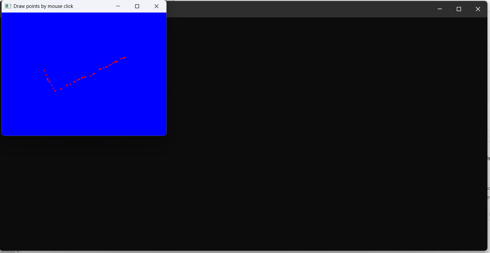{width=90%}
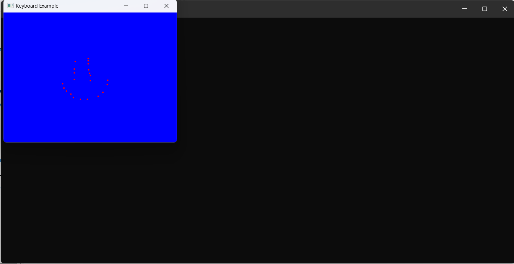{width=90%}
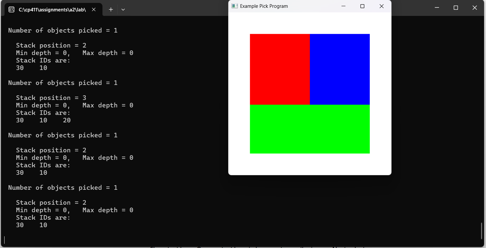{width=90%}

<!-- If No, add a short description to describe the issues encountered.-->

### Q2.3 Bitmap file I/O 

Complete? Yes

<!--If you answer Yes, insert one or more screenshot images to show the completion.-->

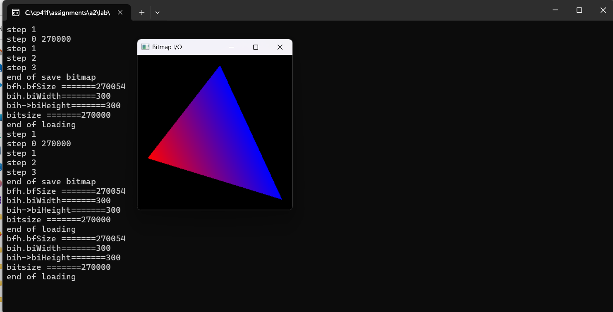{width=90%}

<!-- If No, add a short description to describe the issues encountered.-->

## Q3 SimpleDraw (programming)

### Q3.1 Display window and menu

Complete? Yes

<!-- Screenshot showing the display window and menu implementation -->
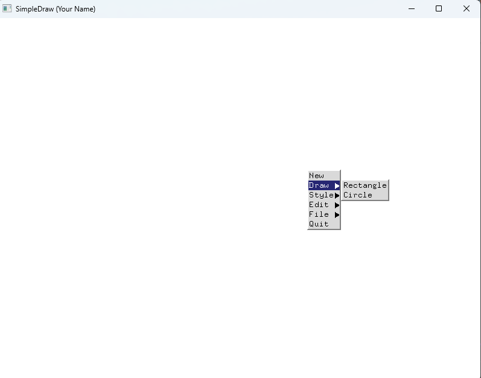{width=90%}

Implementation: Created a SimpleDraw application using OpenGL and Glut. The program opens a window and displays a menu with options for drawing and editing shapes. The menu is implemented using Glut's menu functions and is accessible via right-click.

### Q3.2 Data structures

Complete? Yes

<!-- Screenshot showing the data structure implementation -->
{width=90%}

Implementation: Defined C++ structs for Rectangle and Circle, and used a vector to store all shapes. Each struct contains properties such as position, size, and color. The vector allows dynamic addition and management of shapes for drawing and editing.

### Q3.3 Draw rectangles

Complete? Yes

<!--If you answer Yes, insert one or more screenshot images to show the completion. -->

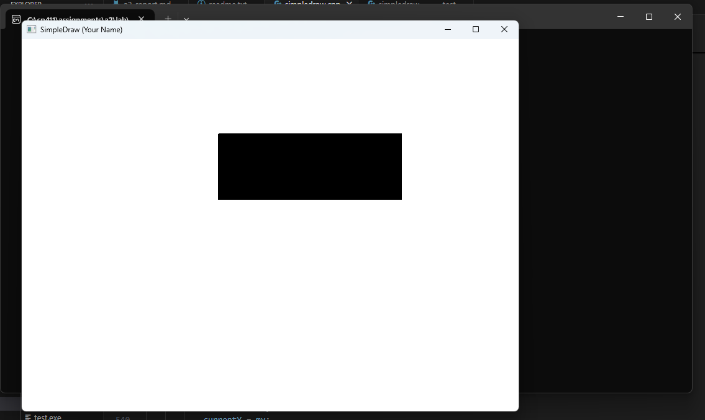{width=90%}

<!--If No, add a short description to describe the issues encountered.-->

### Q3.4 Draw circles

Complete? Yes

<!--If you answer Yes, insert one or more screenshot images to show the completion. -->

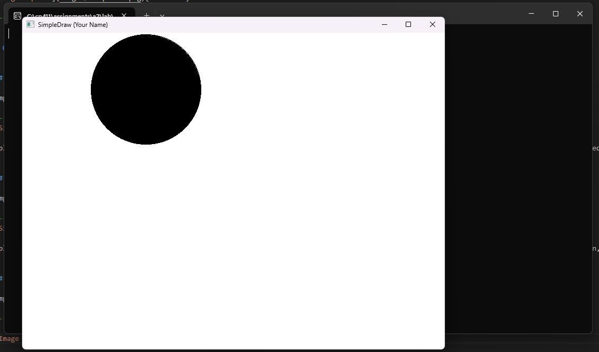{width=90%}

<!--If No, add a short description to describe the issues encountered.-->

### Q3.5 Edit features

Complete? Yes 

<!--If you answer Yes, insert one or more screenshot images to show the completion. -->

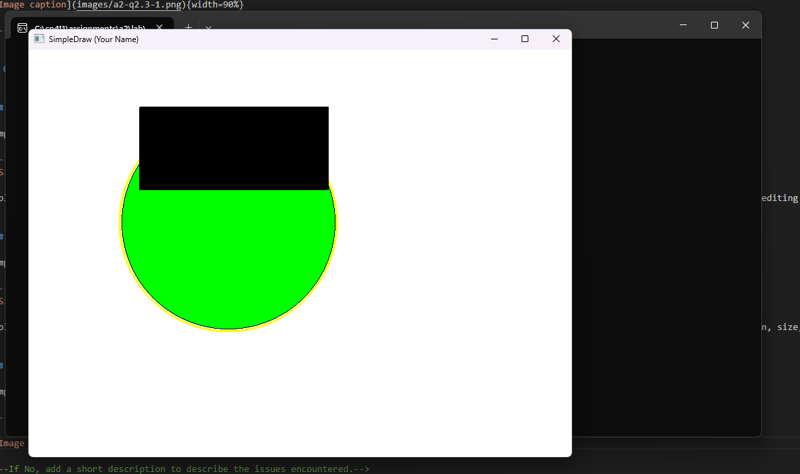{width=90%}

<!--If No, add a short description to describe the issues encountered.-->

### Q3.6 Save/Open SVG files

Complete? Yes

If you answer Yes, link the image
.

### Q3.7 Export to bitmap

Complete? Yes

If you answer Yes, link the image
.

### Q3.8 Circle&Square artwork

Complete? Yes

If you answer Yes, link the images
[C&S artwork in SVG](images/c&s.svg)
.

**References**

1. CP411 a2
2. Add your references if you used any. 
