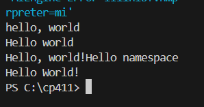
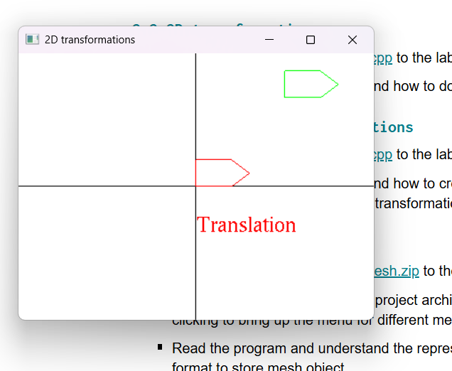
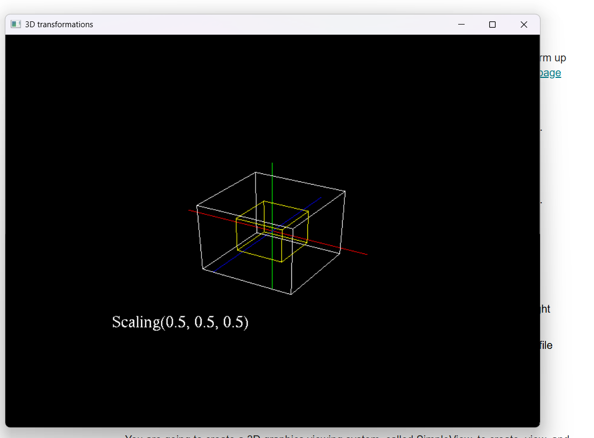
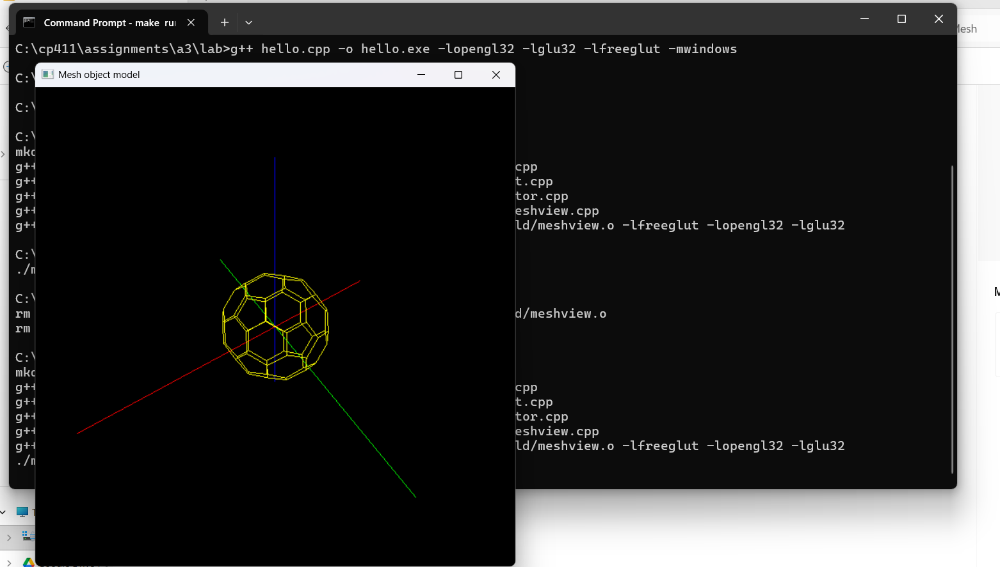
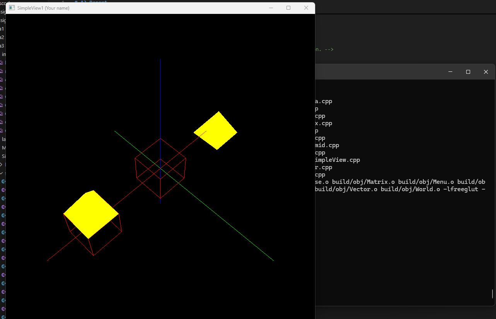
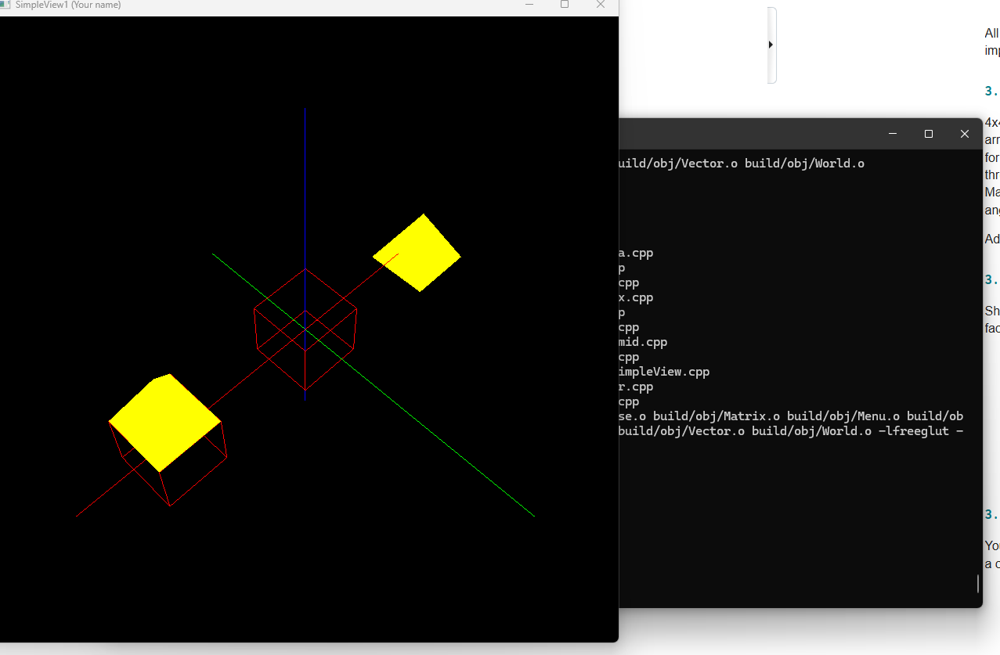
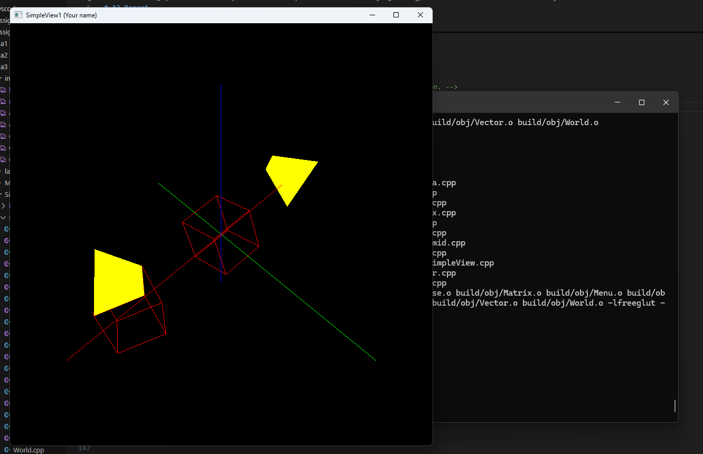
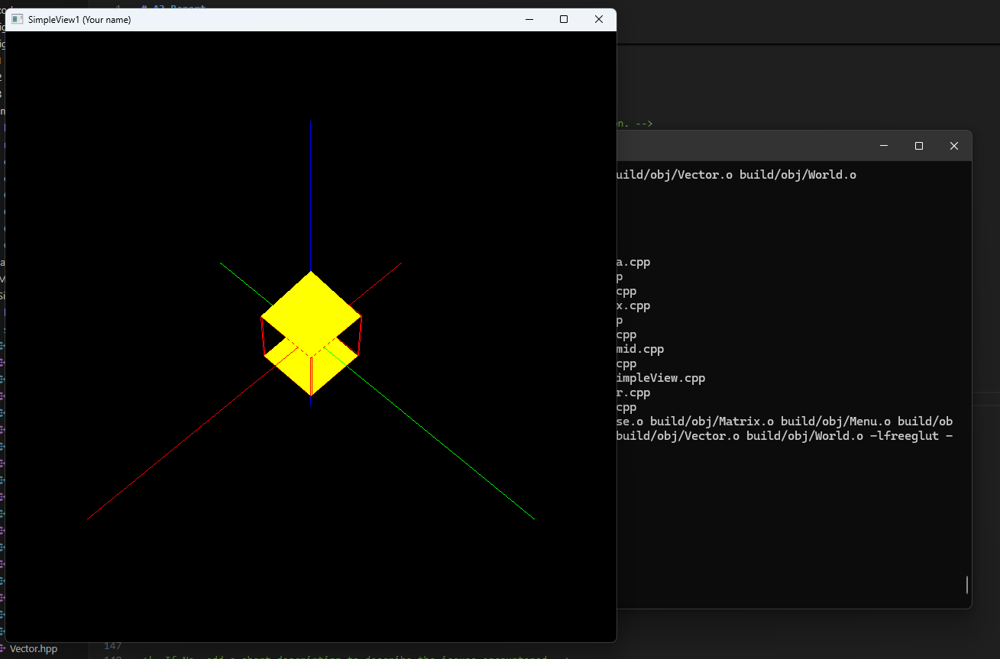
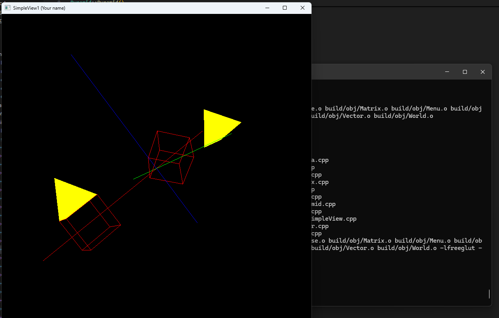

# A3 Report

Author: Sebastian Gubacsi

Date: 2025-10-22 

Check [readme.txt](readme.txt) for course work statement and self-evaluation. 
  
## Q1 Transformations in CG (description)

### Q1.1 Principle of CG transformations
Use your own words briefly answer the following questions.

**1.**What are the three basic transformations?\
**2.**What is a composite transformation?\
**3.**Why Homogeneous coordinate system is used in transformation representation and computing?\

**1. Three basic transformations:**

* **Translation** – moves an object from one place to another.
* **Scaling** – changes the size of an object.
* **Rotation** – turns an object around a fixed point.

**2. Composite transformation:**
A composite transformation combines two or more basic transformations (like rotation followed by scaling) into a single operation using matrix multiplication.

**3. Homogeneous coordinate system use:**
Homogeneous coordinates allow translation, scaling, and rotation to be represented and computed using **a single matrix form**, making it easier to combine multiple transformations through matrix multiplication.

### Q1.2 Hand on 2D transformations

Given the following diagram,
{width=90%}
2D transform
**1.** Describe the sequence of basic 2D transformations to transform triangle ABC to triangle A’B’C’, namely, A to A’, B to B’, and C to C’, by writing the transformation notations and matrices in Homogeneous of the above basic transformations. Hint: it needs 3 basic transformations.\
**2.** Compute the transformation matrix of the composite transformation.\
**3.** Apply the composite transformation matrix to A, B, C to verify that A, B, C are transformed to A’, B’, C’, respectively.\

{width=90%}

## Q2 CG transformation programming (lab practice)

### Q2.1 Warm up with C++ 

Complete? Yes

<!--If you answer Yes, insert one or more screenshot images to show the completion.-->

{width=90%}

<!-- If No, add a short description to describe the issues encountered.-->

### Q2.2 2D transformations 

Complete? Yes

<!--If you answer Yes, insert one or more screenshot images to show the completion.-->

{width=90%}

<!-- If No, add a short description to describe the issues encountered.-->

### Q2.3 3D objects and transformations 

Complete? Yes

<!--If you answer Yes, insert one or more screenshot images to show the completion.-->

{width=90%}

<!-- If No, add a short description to describe the issues encountered.-->

### Q2.4 Mesh object model 

Complete? Yes

<!--If you answer Yes, insert one or more screenshot images to show the completion.-->

{width=90%}

<!-- If No, add a short description to describe the issues encountered.-->

## Q3 SimpleView - transformations (programming)

### Q3.1 Create and render cube objects

Complete? Yes

<!--If you answer Yes, insert one or more screenshot images to show the completion. -->

{width=90%}

<!--If No, add a short description to describe the issues encountered.-->

### Q3.2 Create and render pyramid object

Complete? Yes

<!--If you answer Yes, insert one or more screenshot images to show the completion. -->

{width=90%}

<!--If No, add a short description to describe the issues encountered.-->

### Q3.3 Create and render house object

Complete? Yes

<!--If you answer Yes, insert one or more screenshot images to show the completion. -->

{width=90%}

<!--If No, add a short description to describe the issues encountered.-->

### Q3.4 MCS transforms

Complete? Yes

<!--If you answer Yes, insert one or more screenshot images to show the completion. -->

{width=90%}

<!--If No, add a short description to describe the issues encountered.-->

### Q3.5 WCS transforms

Complete? Yes 

<!--If you answer Yes, insert one or more screenshot images to show the completion. -->

{width=90%}

<!--If No, add a short description to describe the issues encountered.-->

### Q3.6 VCS transforms

Complete? Yes

<!--If you answer Yes, insert one or more screenshot images to show the completion. -->

{width=90%}

<!--If No, add a short description to describe the issues encountered.-->

**References**

1. CP411 a3
2. Add your references if you used any. 

refernces used:
provide example project file and other provided code.
