# A4 Report

Author: Sebastian Gubacsi

Date: 2025-11-04 

Check [readme.txt](readme.txt) for course work statement and self-evaluation. 
  
## Q1 Culling, Lighting, Shading (description)

### Q1.1 Concepts of culling

What is the difference between culling and clipping?
## 1. Culling
**Culling** means skipping objects or surfaces that cannot be seen by the viewer.  
It helps the computer work faster by not drawing things that are invisible.

**Types:**
- **Back-face culling:** Removes surfaces facing away from the camera.  
- **View frustum culling:** Removes objects outside the camera’s view.

---

## 2. Difference between Culling and Clipping
| Aspect | Culling | Clipping |
|---------|----------|-----------|
| **Meaning** | Removes objects that are not visible at all | Cuts off parts of objects that are partly outside the view |
| **Where it happens** | Before drawing starts | During the drawing process |
| **Example** | Skipping the back side of a cube | Cutting a line so only the visible part shows |

What is the difference between object precision and image precision hidden surface removal methods? Give an example of each method.

| Aspect | Object Precision | Image Precision |
|---------|------------------|-----------------|
| **Meaning** | Decides what is visible by comparing objects in 3D before drawing | Decides what is visible by comparing pixels on the screen |
| **Work space** | 3D world | 2D image |
| **Example** | **Painter’s algorithm:** draws from back to front | **Z-buffer:** keeps the closest pixel visible |

### Q1.2 Culling computing

Culling computing
Given:

Eye position at E(3, 2, 2), and
Reference (look at) point at R(0, 0, 0).
Compute to determine if triangle P1(1,0,0)P2(0,1,0)P3(0, 0, 1) is a back face.
Compute the depth (z-value) of the above triangle.

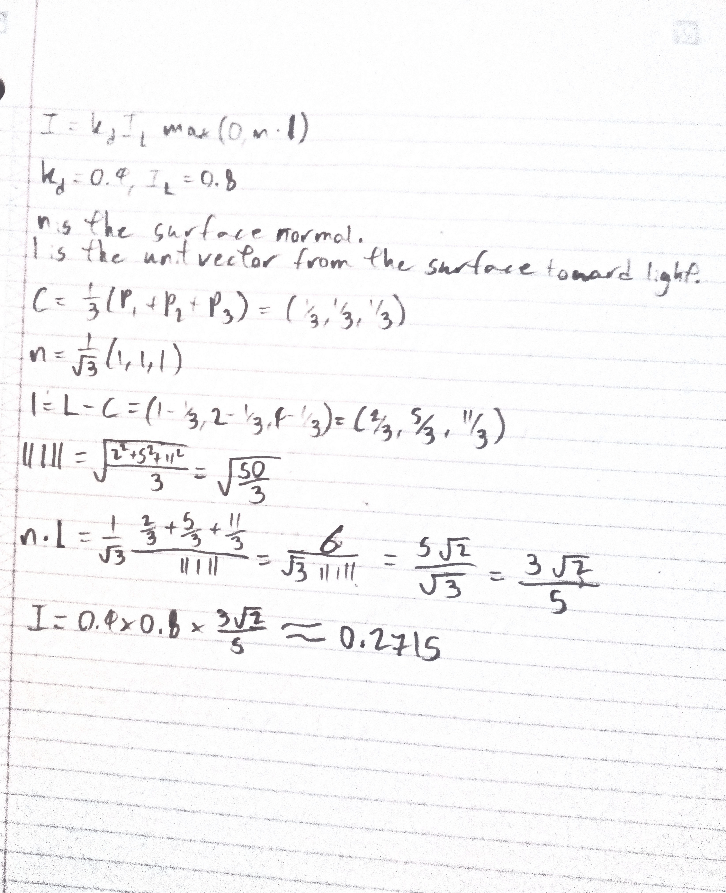{width=90%}

### Q1.3 Concepts of lighting and shading

### 1. What does a color model do? Give the names of three color models.
### 2. What does a light source model determine? Give the names of three light source models.
### 3. What does a reflection model determine? Give the names of three reflection models.
### 4. What does a shading model determine? Give the names of three shading models.

What does a color model do?
It specifies how colors are represented numerically (how components map to perceived color).
Examples: RGB, CMYK, HSV.

What does a light source model determine?
It determines how light is emitted from (or arrives at) scene points: direction, intensity falloff, and angular distribution.
Examples: Point light, Directional light, Spotlight.

What does a reflection model determine?
It determines how surface micro-structure reflects incoming light into outgoing radiance at a point (combines diffuse/specular terms, BRDF, etc.).
Examples: Lambertian (diffuse), Phong reflection model, Cook–Torrance (microfacet).

What does a shading model determine?
It determines how illumination computed at points/normals is interpolated and used to produce final pixel colors (how per-vertex/per-pixel lighting is computed/interpolated).
Examples: Flat shading, Gouraud shading, Phong shading.

### Q1.4 Lighting computing

Given:

Eye position at E(3, 2, 2), point light position at L(1, 2, 4) with light intensity 0.8,
Triangle P1(1,0,0)P2(0,1,0)P3(0, 0, 1), and surface diffusion rate 0.4 for red color.
Compute the simple diffusion reflection intensity of red color at the center of the triangle. (Use the simple diffusion reflection formula in slide 10 of lecture 13 (lighting).)

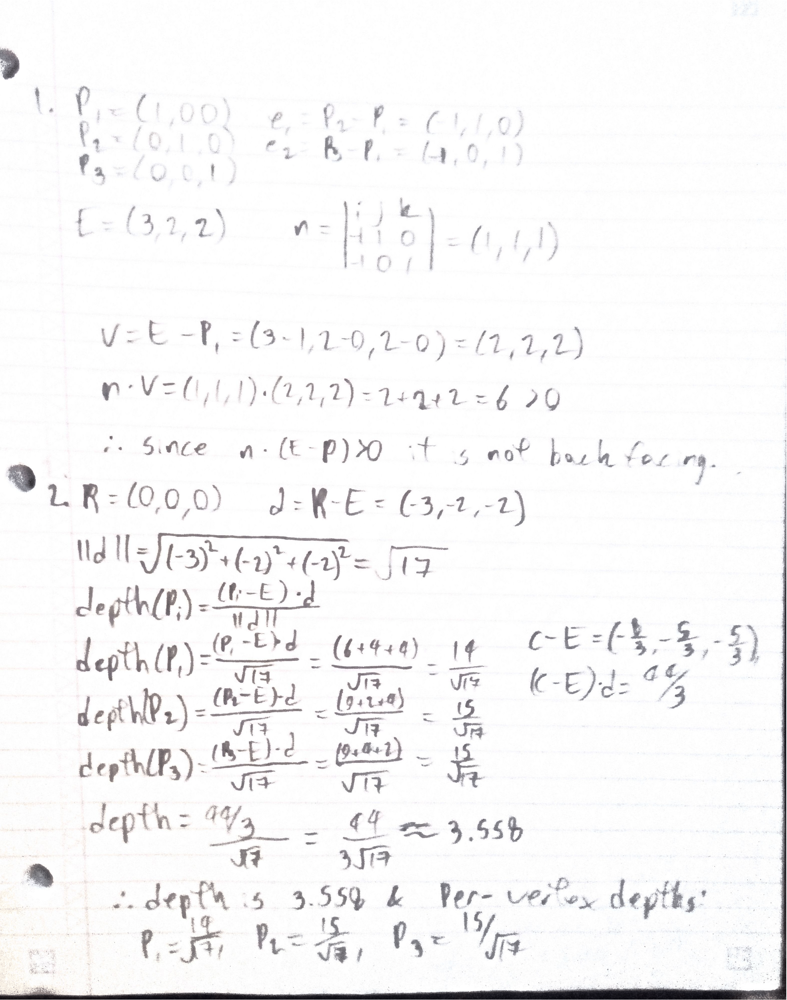{width=90%}

## Q2 OpenGL Culling, Lighting, Shading (lab practice)

### Q2.1 Hidden surface removal 

Complete? Yes

<!--If you answer Yes, insert one or more screenshot images to show the completion.-->

{width=90%}
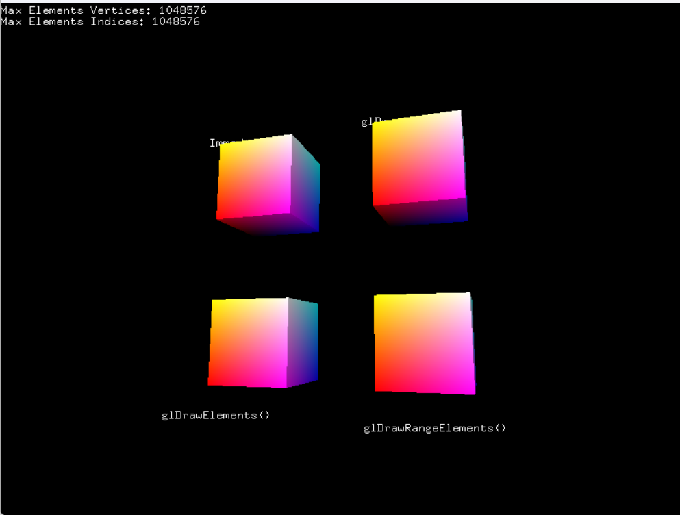{width=90%}

<!-- If No, add a short description to describe the issues encountered.-->

### Q2.2 Lighting and shading 

Complete? Yes

<!--If you answer Yes, insert one or more screenshot images to show the completion.-->

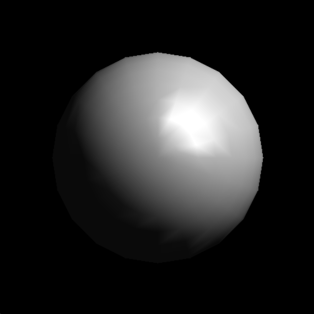{width=90%}
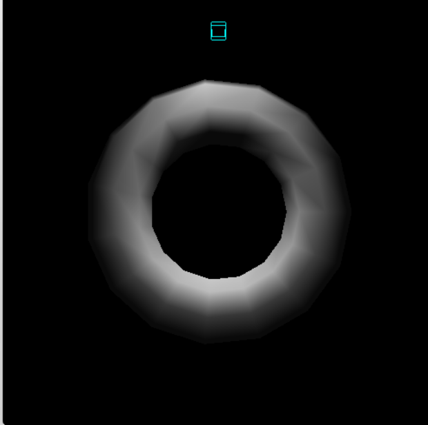{width=90%}
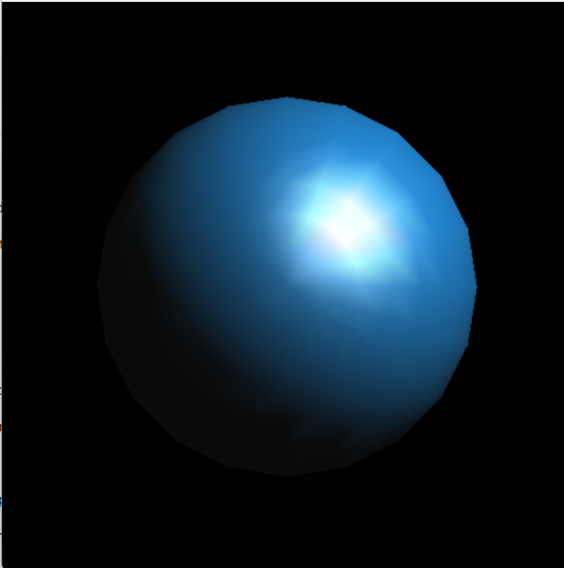{width=90%}
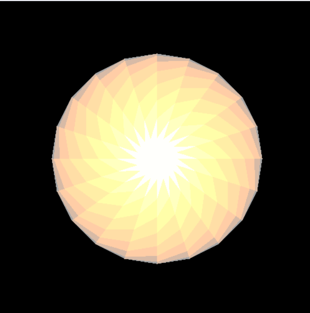{width=90%}

<!-- If No, add a short description to describe the issues encountered.-->

### Q2.3 Animation 

Complete? Yes

<!--If you answer Yes, insert one or more screenshot images to show the completion.-->

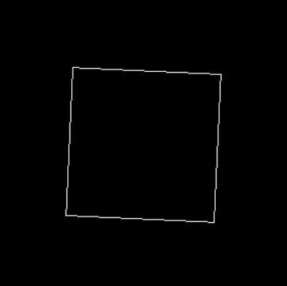{width=90%}

<!-- If No, add a short description to describe the issues encountered.-->

## Q3 SimpleView2 Culling, Lighting, Shading (programming)

### Q3.1 Culling

Complete? Yes

<!--If you answer Yes, insert one or more screenshot images to show the completion. -->

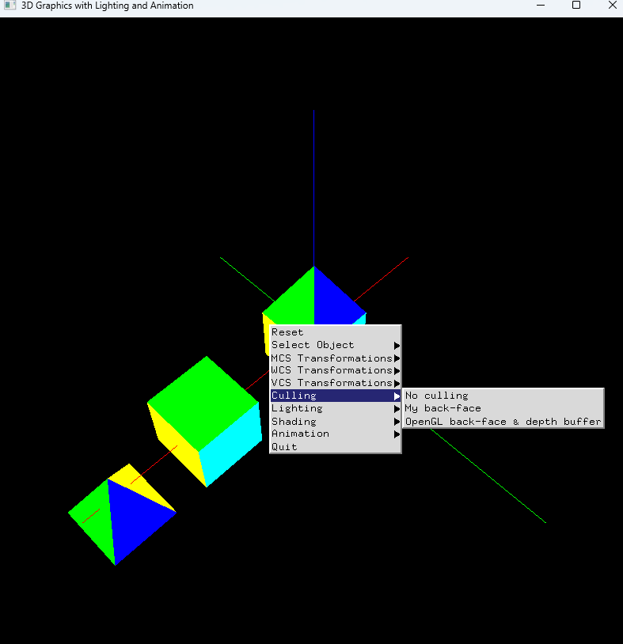{width=90%}

<!--If No, add a short description to describe the issues encountered.-->

### Q3.2 Lighting

Complete? Yes

<!--If you answer Yes, insert one or more screenshot images to show the completion. -->

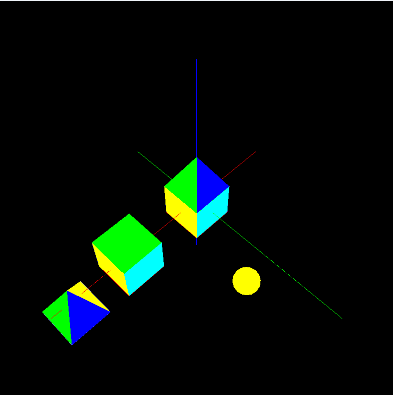{width=90%}

<!--If No, add a short description to describe the issues encountered.-->

### Q3.3 Shading

Complete? Yes

<!--If you answer Yes, insert one or more screenshot images to show the completion. -->

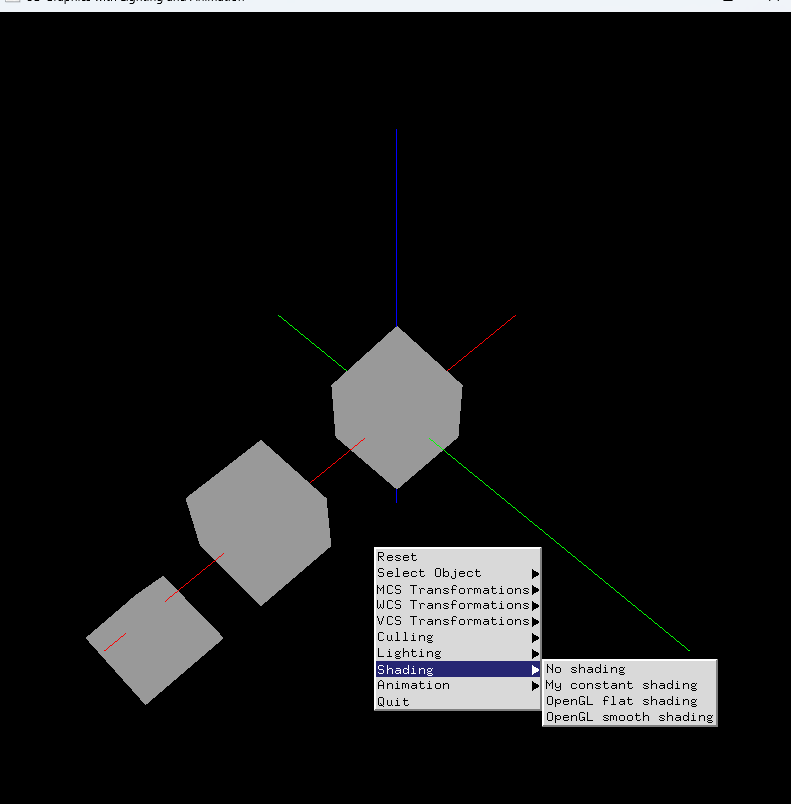{width=90%}

<!--If No, add a short description to describe the issues encountered.-->

### Q3.4 Animations

Complete? Yes

<!--If you answer Yes, insert one or more screenshot images to show the completion. -->

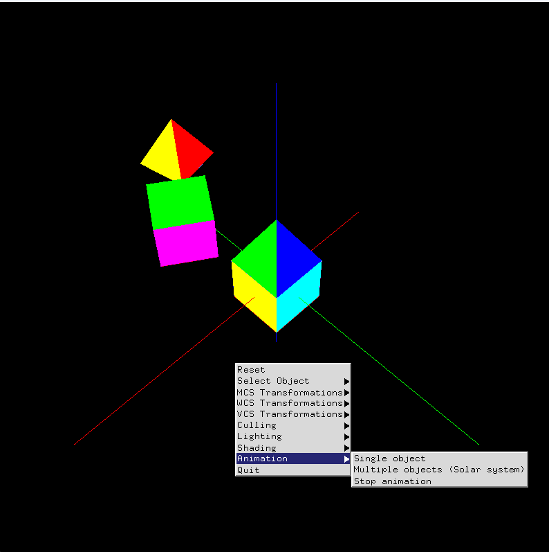{width=90%}

<!--If No, add a short description to describe the issues encountered.-->

**References**

1. CP411 a4
2. Add your references if you used any. 

any provide code and ai was used as a reference
